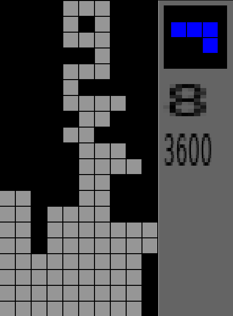
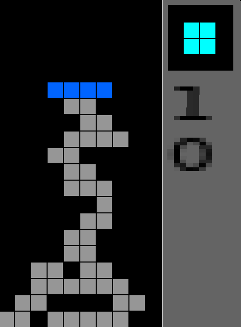

#Tetris Clone
=================

A Tetris clone written in C and using the SDL Graphics Library

#Controls:
=================
Arrow Keys - Move tetrimino to direction
Space Bar - Drop

#Known Issues:
=================
* Holding drop will sometimes cause the tetriminos to go through some blocks

#Screenshot:
=================
 
 
